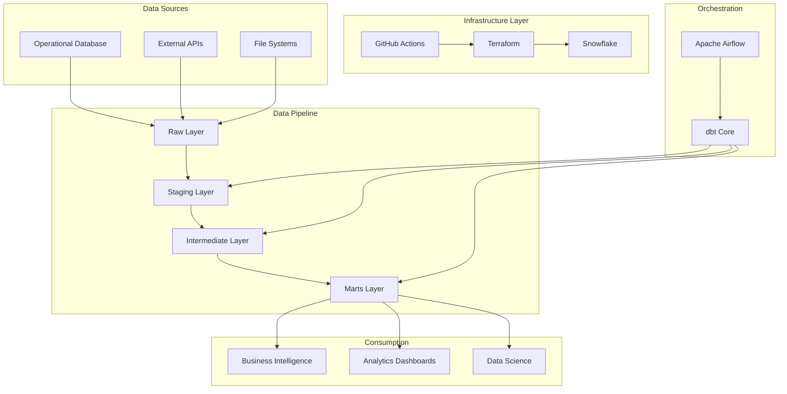

# Enterprise Finance Data Platform

A state-of-the-art data engineering platform built with modern tools and best practices for scalable analytics and business intelligence.

[](https://github.com/your-org/finance-data-platform/actions)
[](https://github.com/your-org/finance-data-platform/actions)
[](https://github.com/your-org/finance-data-platform/actions)

## 🎯 Overview

This project implements a production-ready data engineering pipeline that transforms raw financial data into actionable business insights. Built with industry best practices, it provides:

- **📊 Scalable Data Architecture**: Layered approach with staging, intermediate, and marts
- **🏗️ Infrastructure as Code**: Complete Terraform automation for Snowflake resources
- **🧪 Comprehensive Testing**: 50+ data quality, integrity, and business logic tests
- **🚀 CI/CD Pipeline**: Automated testing, deployment, and monitoring
- **📈 Data Observability**: End-to-end monitoring and alerting
- **📚 Rich Documentation**: Auto-generated docs and lineage

## 🛠️ Tech Stack

| Category | Tools |
|----------|--------|
| **Data Warehouse** | Snowflake |
| **Transformation** | dbt Core |
| **Orchestration** | Apache Airflow |
| **Infrastructure** | Terraform |
| **CI/CD** | GitHub Actions |
| **Data Quality** | dbt tests, Great Expectations |
| **Monitoring** | Slack, Email notifications |
| **Documentation** | dbt docs, Terraform docs |

## 🏗️ Architecture



## 📁 Project Structure

```
finance-data-platform/
├── 📁 .github/workflows/          # CI/CD pipelines
│   ├── ci.yml                     # Continuous Integration
│   ├── cd.yml                     # Continuous Deployment
│   └── terraform.yml              # Infrastructure automation
├── 📁 terraform/                  # Infrastructure as Code
│   ├── main.tf                    # Main Terraform configuration
│   ├── variables.tf               # Variable definitions
│   ├── snowflake_resources.tf     # Snowflake resources
│   └── outputs.tf                 # Output definitions
├── 📁 models/                     # dbt models
│   ├── 📁 staging/                # Raw data transformations
│   ├── 📁 intermediate/           # Business logic layer
│   ├── 📁 marts/                  # Final business entities
│   └── 📁 example/                # Source definitions
├── 📁 tests/                      # Data quality tests
│   ├── 📁 generic/                # Reusable test definitions
│   └── 📁 singular/               # Specific business tests
├── 📁 macros/                     # dbt macros and utilities
├── 📁 seeds/                      # Reference data
├── 📁 snapshots/                  # SCD Type 2 tables
├── 📄 dbt_project.yml             # dbt configuration
├── 📄 packages.yml                # dbt package dependencies
├── 📄 dbt_core_dag.py             # Airflow DAG
└── 📄 README.md                   # This file
```

## 🚀 Quick Start

### Prerequisites

- **Snowflake Account**: Active account with admin privileges
- **Python 3.11+**: For dbt and Airflow
- **Terraform 1.6+**: For infrastructure provisioning
- **Git**: Version control
- **Docker** (optional): For local development

### 1. Clone the Repository

```bash
git clone https://github.com/your-org/finance-data-platform.git
cd finance-data-platform
```

### 2. Set Up Infrastructure

```bash
# Navigate to terraform directory
cd terraform

# Copy and configure variables
cp terraform.tfvars.example terraform.tfvars
# Edit terraform.tfvars with your Snowflake credentials

# Initialize and apply infrastructure
terraform init
terraform plan
terraform apply
```

### 3. Configure dbt

```bash
# Create dbt profiles directory
mkdir -p ~/.dbt

# Create profiles.yml
cat << EOF > ~/.dbt/profiles.yml
finance_data_platform:
  outputs:
    dev:
      type: snowflake
      account: YOUR_ACCOUNT
      user: YOUR_USERNAME
      password: YOUR_PASSWORD
      role: DBT_ROLE
      database: FINANCE_DB_DEV
      warehouse: FINANCE_WH_DEV
      schema: raw
      threads: 4
  target: dev
EOF
```

### 4. Install Dependencies

```bash
# Create virtual environment
python -m venv dbt-env
source dbt-env/bin/activate  # Linux/Mac
# dbt-env\Scripts\activate   # Windows

# Install dbt and dependencies
pip install dbt-core dbt-snowflake
dbt deps
```

### 5. Run the Pipeline

```bash
# Test connection
dbt debug

# Run models
dbt seed          # Load reference data
dbt run           # Build models
dbt test          # Run tests
dbt docs generate # Generate documentation
```

## 📊 Data Model Overview

### Staging Layer (`staging/`)
- **Purpose**: Raw data cleaning and standardization
- **Models**: `stg_customers`, `stg_orders`, `stg_order_items`, `stg_products`
- **Transformations**: Data type conversion, null handling, basic cleaning

### Intermediate Layer (`intermediate/`)
- **Purpose**: Business logic application and enrichment
- **Models**: `int_order_enriched`
- **Transformations**: Joins, calculations, aggregations

### Marts Layer (`marts/`)
- **Purpose**: Final business entities for consumption
- **Core Models**: `dim_customers`, `fct_order_line_items`
- **Analytics Models**: `fct_daily_order_revenue`

## 🧪 Testing Strategy

### Test Categories

| Category | Count | Description |
|----------|-------|-------------|
| **Source Tests** | 20+ | Data freshness, completeness, format validation |
| **Model Tests** | 30+ | Primary keys, foreign keys, not null, unique |
| **Business Logic** | 15+ | Domain-specific rules and calculations |
| **Data Quality** | 10+ | Outliers, duplicates, consistency checks |

### Running Tests

```bash
# Run all tests
dbt test

# Run specific test categories
dbt test --select tag:data_quality
dbt test --select tag:business_logic
dbt test --select tag:data_integrity

# Run tests for specific models
dbt test --select stg_orders
dbt test --select marts.finance
```

## 🔧 Development Workflow

### Local Development

1. **Create Feature Branch**
   ```bash
   git checkout -b feature/your-feature-name
   ```

2. **Make Changes**
   - Modify models, tests, or documentation
   - Follow naming conventions (`stg_`, `int_`, `fct_`, `dim_`)

3. **Test Locally**
   ```bash
   dbt run --select state:modified+
   dbt test --select state:modified+
   ```

4. **Commit and Push**
   ```bash
   git add .
   git commit -m "feat: add customer segmentation model"
   git push origin feature/your-feature-name
   ```

5. **Create Pull Request**
   - CI pipeline will run automatically
   - Review and merge after approval

### Code Standards

- **SQL Style**: Follow SQLFluff configuration
- **Naming**: Use clear, descriptive names
- **Documentation**: All models must have descriptions
- **Testing**: New models require appropriate tests

## 🚀 Deployment

### Environments

| Environment | Purpose | Database | Warehouse |
|-------------|---------|----------|-----------|
| **dev** | Development | `FINANCE_DB_DEV` | `FINANCE_WH_DEV` |
| **staging** | Pre-production | `FINANCE_DB_STAGING` | `FINANCE_WH_STAGING` |
| **prod** | Production | `FINANCE_DB` | `FINANCE_WH` |

### Deployment Process

1. **Automated via CI/CD**
   - Merge to `main` triggers staging deployment
   - Manual approval required for production

2. **Manual Deployment**
   ```bash
   # Deploy to staging
   dbt run --target staging
   
   # Deploy to production
   dbt run --target prod
   ```

## 📈 Monitoring & Observability

### Key Metrics Tracked

- **Data Freshness**: Source data recency
- **Test Results**: Pass/fail rates by category
- **Model Performance**: Runtime and row counts
- **Pipeline Health**: Success rates and error patterns

### Alerting

- **Slack**: Real-time notifications for failures
- **Email**: Daily/weekly summary reports
- **Dashboards**: Grafana/Tableau monitoring

## 🔍 Troubleshooting

### Common Issues

| Issue | Solution |
|-------|----------|
| **dbt connection failed** | Check `profiles.yml` credentials |
| **Model compilation error** | Verify SQL syntax and references |
| **Test failures** | Review test logic and data quality |
| **Airflow task failure** | Check logs and environment variables |

### Debug Commands

```bash
# Check dbt configuration
dbt debug

# Compile without running
dbt compile

# Show model dependencies
dbt list --select +model_name+

# Check source freshness
dbt source freshness
```

## 📚 Documentation

- **dbt Docs**: Auto-generated at `/target/index.html`
- **API Documentation**: Available in `/docs/api/`
- **Runbooks**: Operational guides in `/docs/runbooks/`
- **Architecture**: Design documents in `/docs/architecture/`

## 🤝 Contributing

1. **Fork the Repository**
2. **Create Feature Branch**
3. **Follow Code Standards**
4. **Add Tests**
5. **Update Documentation**
6. **Submit Pull Request**

See [CONTRIBUTING.md](CONTRIBUTING.md) for detailed guidelines.

## 📄 License

This project is licensed under the MIT License - see [LICENSE](LICENSE) file.

## 🆘 Support

- **Issues**: [GitHub Issues](https://github.com/your-org/finance-data-platform/issues)
- **Discussions**: [GitHub Discussions](https://github.com/your-org/finance-data-platform/discussions)
- **Slack**: `#data-engineering` channel
- **Email**: data-engineering@yourcompany.com

## 🏆 Acknowledgments

- dbt Community for excellent documentation
- Snowflake for robust data platform
- Contributors and maintainers


