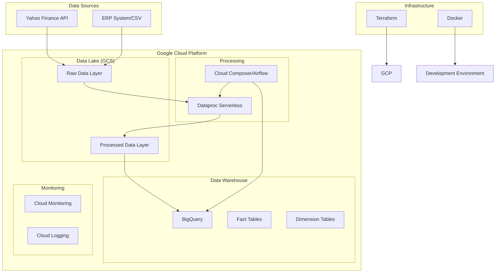

# Stock Market Pipeline Architecture

## Overview

This document describes the architecture of the modern stock market data pipeline, a serverless solution built on Google Cloud Platform for processing and analyzing financial data.

## System Architecture

### High-Level Components



### Data Flow

1. **Data Extraction**: Daily extraction of stock prices from Yahoo Finance API
2. **Data Storage**: Raw data stored in Google Cloud Storage in JSON format
3. **Data Processing**: PySpark jobs on Dataproc Serverless transform raw data
4. **Data Loading**: Processed data loaded into BigQuery dimensional model
5. **Orchestration**: Airflow/Composer manages the entire workflow

## Technology Stack

### Core Technologies
- **Python 3.11**: Primary programming language
- **Apache Airflow**: Workflow orchestration
- **Apache Spark**: Data processing and transformation
- **Google Cloud Platform**: Cloud infrastructure
- **Terraform**: Infrastructure as Code
- **Docker**: Containerization

### Google Cloud Services
- **Cloud Storage**: Data lake for raw and processed data
- **Dataproc Serverless**: Managed Spark processing
- **BigQuery**: Data warehouse and analytics
- **Cloud Composer**: Managed Airflow service
- **Cloud Monitoring**: System monitoring and alerting
- **Cloud Logging**: Centralized logging

### Development Tools
- **uv**: Fast Python package management
- **pytest**: Testing framework
- **black**: Code formatting
- **ruff**: Linting and code analysis
- **mypy**: Type checking
- **pre-commit**: Git hooks for code quality

## Project Structure

```
stock-market-modern-elt-pipeline-main/
├── src/                           # Source code modules
│   ├── config/                    # Configuration management
│   ├── extractors/               # Data extraction logic
│   └── transformers/             # Data transformation logic
├── dags/                         # Airflow DAG definitions
├── dataproc_jobs/               # PySpark job scripts
├── terraform/                   # Infrastructure as Code
│   ├── schemas/                 # BigQuery table schemas
│   ├── main.tf                  # Main Terraform configuration
│   ├── variables.tf             # Variable definitions
│   └── outputs.tf               # Output definitions
├── tests/                       # Test suite
├── data/                        # Sample and reference data
├── docker-compose.yml           # Multi-service Docker setup
├── Dockerfile                   # Container definition
├── pyproject.toml              # Python project configuration
└── Makefile                    # Automation scripts
```

## Data Model

### Dimensional Model Design

The pipeline implements a star schema with one fact table and multiple dimension tables:

#### Fact Table
- **fact_stock_price**: Daily stock price metrics
  - DateKey (Foreign Key to dim_date)
  - Ticker (Foreign Key to dim_company)
  - Open, High, Low, Close prices
  - Volume

#### Dimension Tables
- **dim_company**: Company information
  - Symbol (Primary Key)
  - CompanyName

- **dim_exchange**: Stock exchange information
  - ExchangeCode (Primary Key)
  - ExchangeName

- **dim_date**: Date dimension
  - DateKey (Primary Key)
  - FullDate, DayOfWeek, Month, Quarter, Year

## Infrastructure Components

### Storage Architecture
- **Raw Layer**: JSON files from Yahoo Finance API
- **Processed Layer**: Parquet files optimized for analytics
- **Lifecycle Management**: Automatic data retention and archival

### Processing Architecture
- **Serverless**: Dataproc Serverless for automatic scaling
- **Resource Optimization**: Adaptive query execution in Spark
- **Error Handling**: Comprehensive logging and monitoring

### Security
- **IAM**: Role-based access control
- **Service Accounts**: Dedicated service accounts per component
- **Encryption**: Data encrypted at rest and in transit
- **Network Security**: Private IP configuration options

## Scalability and Performance

### Horizontal Scaling
- Dataproc Serverless automatically scales processing resources
- Cloud Composer workers scale based on workload
- BigQuery scales automatically for query processing

### Performance Optimizations
- Parquet format for efficient columnar storage
- Partitioning and clustering in BigQuery
- Spark adaptive query execution
- Connection pooling and caching

### Monitoring and Observability
- Cloud Monitoring for infrastructure metrics
- Cloud Logging for application logs
- Custom alerts for pipeline failures
- Performance dashboards

## Development Workflow

### Local Development
1. Use Docker Compose for local testing
2. Pre-commit hooks ensure code quality
3. Comprehensive test suite with pytest
4. Type checking with mypy

### CI/CD Pipeline
1. Code quality checks (linting, formatting, type checking)
2. Unit and integration tests
3. Infrastructure validation with Terraform plan
4. Automated deployment to staging/production

### Environment Management
- Development: Local Docker environment
- Staging: Reduced-scale GCP environment
- Production: Full-scale GCP environment with monitoring

## Disaster Recovery

### Backup Strategy
- GCS bucket versioning enabled
- BigQuery dataset backup to separate project
- Terraform state stored in remote backend
- Infrastructure as Code enables rapid rebuild

### Recovery Procedures
- Automated failover for critical components
- Point-in-time recovery for data corruption
- Cross-region replication for high availability
- Documented runbooks for manual recovery

## Cost Optimization

### Resource Management
- Serverless components reduce idle costs
- Automatic shutdown of unused resources
- Storage lifecycle management
- Query optimization in BigQuery

### Monitoring
- Cost alerts for budget overruns
- Resource utilization dashboards
- Regular cost reviews and optimizations
