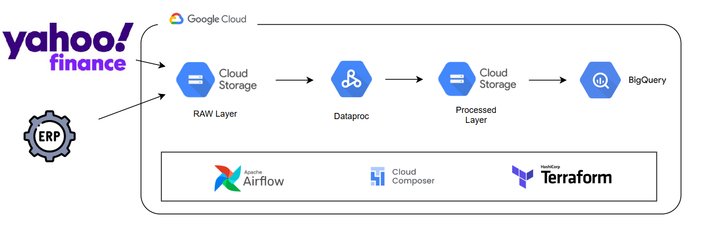

# 🚀 Modern Stock Market Data Pipeline

[](https://www.python.org/downloads/)
[](https://opensource.org/licenses/MIT)
[](https://github.com/psf/black)
[](https://www.terraform.io/)

A production-ready, fully serverless data pipeline that centralizes and processes stock market data from selected companies. Built with modern software engineering practices and a scalable data architecture using Google Cloud Platform, Apache Spark, and Terraform.

## ✨ Key Features

- 🏗️ **Modern Architecture**: Serverless, cloud-native design with automatic scaling
- 🔄 **Real-time Processing**: Daily automated extraction and processing of stock data
- 📊 **Dimensional Modeling**: Star schema optimized for analytics and reporting
- 🛡️ **Production Ready**: Comprehensive monitoring, alerting, and error handling
- 🐳 **Containerized**: Docker support for local development and testing
- ⚡ **Fast Development**: Modern Python tooling with uv, pre-commit hooks, and automated testing
- 📈 **Scalable**: Handles growing data volumes with automated resource management
- 🔒 **Secure**: IAM-based security, encryption at rest and in transit

## 🏛️ Architecture Overview

The pipeline implements a modern ELT (Extract, Load, Transform) pattern with the following components:

- **Data Sources**: Yahoo Finance API, ERP systems
- **Data Lake**: Google Cloud Storage with raw and processed layers
- **Processing Engine**: Apache Spark on Dataproc Serverless
- **Data Warehouse**: Google BigQuery with dimensional model
- **Orchestration**: Apache Airflow on Cloud Composer
- **Infrastructure**: Terraform for Infrastructure as Code
- **Monitoring**: Cloud Monitoring and Logging

## Dataset

**Yahoo Finance** is used as the primary data source for this project. It's a free and reliable source that doesn't require API keys or authentication. We use the Python library `yfinance` to extract historical stock price data daily.

By default, we're fetching data from MAANG companies (META, AAPL, AMZN, NFLX, GOOGL), but you can easily modify the company list in the code.

## Tools and Technologies

- **Google Cloud Storage:** Data lake to store data files in two layers: Raw and Processed with Parquet files.
- **Dataproc Serverless (PySpark):** Handles data transformation and formatting into a dimensional model.
- **Google BigQuery:** Analytical data warehouse and dashboard backend.
- **Google Composer (Airflow):** Orchestrates the end-to-end data workflow on a daily schedule.
- **Terraform:** Manages infrastructure as code to deploy all cloud resources.
- **Yahoo Finance (yfinance):** Python library for free financial data extraction.
- **uv:** Ultra-fast Python package manager for dependencies and virtual environments.

## Data Architecture

### Technical Architecture



**Data Sources**

- **Yahoo Finance:** The primary financial data source. Provides historical stock price data for free through the `yfinance` library.
- **ERP:** We simulate a second data source by placing CSV files in the raw layer of the data lake. Contains information about various companies and exchanges.

> [!NOTE]
> If any of your selected companies is not included in the `data/erp_companies.csv` file, feel free to add it.

### Dimensional Model


- **fact_stock_price:** This is the central fact table that records daily stock price metrics such as open, close, high, low, and volume. Each record is linked to a specific company, exchange, and date through foreign keys. Its data is fetched from Yahoo Finance and added to the table every time the process runs.
- **dim_company:** A dimension table that stores company information. It's loaded from the ERP file before transformations. Data is loaded after truncating the table.
- **dim_exchange:** A dimension table that stores stock exchange information. It's loaded from the ERP file before transformations. Data is loaded after truncating the table.
- **dim_date:** A standard date dimension table that provides useful time attributes. It's loaded from a pre-prepared CSV file.

## Setup

> [!WARNING]
> Be aware that this project deploys and runs Google Cloud services that may incur costs.

### Prerequisites

> [!NOTE]
> Skip the following steps if already completed.

- [GCP Account and gcloud CLI installation](setup/gcp_setup.md)

- [Terraform Installation](https://developer.hashicorp.com/terraform/tutorials/aws-get-started/install-cli)

- **uv Installation (Recommended):**

```bash
# On macOS/Linux
curl -LsSf https://astral.sh/uv/install.sh | sh

# On Windows
powershell -c "irm https://astral.sh/uv/install.ps1 | iex"

# Or via pip
pip install uv
```

## 🚀 Quick Start

### Prerequisites

- Python 3.11+
- [uv](https://docs.astral.sh/uv/) (recommended) or pip
- [Docker](https://docs.docker.com/get-docker/) and Docker Compose
- [Terraform](https://developer.hashicorp.com/terraform/install/) 1.0+
- [Google Cloud CLI](https://cloud.google.com/sdk/docs/install)
- [Make](https://www.gnu.org/software/make/) (optional but recommended)

### Local Development Setup

```bash
# Clone the repository
git clone <repository-url>
cd stock-market-modern-elt-pipeline-main

# Set up development environment (installs dependencies and pre-commit hooks)
make dev-setup

# Or manually:
uv sync --extra dev
uv run pre-commit install
```

### Development with Docker

Docker is used **exclusively for local development and testing** - not for running production data processing jobs.

```bash
# Development environment (code editing, testing)
make docker-dev

# Run unit tests in Docker
make test-docker

# Jupyter notebook for data exploration
make docker-jupyter

# Pipeline development testing (does NOT run production jobs)
make docker-dev-test

# Local configuration testing
make docker-local-test
```

> [!IMPORTANT]
> **Docker vs Production**: Docker containers are for development/testing only. 
> Production data processing runs on **Airflow/Cloud Composer** with **Dataproc Serverless**.

### Available Commands

The project includes a comprehensive `Makefile` for automation:

```bash
# Development
make help            # Show all available commands
make dev-setup       # Complete development setup
make install         # Install dependencies
make install-dev     # Install with development tools

# Code Quality
make format          # Format code with black
make lint            # Check code with ruff
make lint-fix        # Fix linting issues automatically
make type-check      # Check types with mypy
make check           # Run all quality checks
make test            # Run test suite
make validate        # Complete validation (lint + types + tests)

# Infrastructure
make tf-init         # Initialize Terraform
make tf-plan         # Preview infrastructure changes
make tf-apply        # Deploy infrastructure
make tf-destroy      # Destroy infrastructure

# Docker (Development & Testing Only)
make docker-build      # Build Docker images
make docker-dev        # Start development containers
make docker-dev-test   # Pipeline development testing
make docker-jupyter    # Start Jupyter notebook
make docker-local-test # Local configuration testing
make docker-clean      # Clean up Docker resources

# Pipeline Operations
make upload-erp      # Upload ERP data to GCS
make env-info        # Show environment information
make clean           # Clean temporary files
```

## 📋 Project Structure

```
stock-market-modern-elt-pipeline-main/
├── 📁 src/                          # Source code modules
│   ├── 📁 config/                   # Configuration management
│   ├── 📁 extractors/              # Data extraction logic
│   └── 📁 transformers/            # Data transformation logic
├── 📁 dags/                        # Airflow DAG definitions
├── 📁 dataproc_jobs/              # PySpark job scripts
├── 📁 terraform/                  # Infrastructure as Code
│   ├── 📁 schemas/                # BigQuery table schemas
│   ├── main.tf                    # Main Terraform configuration
│   ├── variables.tf               # Variable definitions
│   └── outputs.tf                 # Output definitions
├── 📁 tests/                      # Comprehensive test suite
├── 📁 data/                       # Sample and reference data
├── 🐳 docker-compose.yml          # Multi-service Docker setup
├── 🐳 Dockerfile                  # Container definition
├── ⚙️ pyproject.toml              # Python project configuration
├── 🔧 Makefile                    # Automation scripts
└── 📚 Documentation files
```

## 🚢 Deployment

> [!IMPORTANT]
> This project deploys GCP resources that may incur costs. Please review the [cost optimization guide](DEPLOYMENT.md#cost-optimization) before deploying.

### 1. GCP Setup

Follow the [detailed GCP setup guide](setup/gcp_setup.md) to:
- Create a GCP project
- Set up authentication
- Enable required APIs
- Create service accounts

### 2. Configure Environment

```bash
# Set required environment variables
export GOOGLE_CLOUD_PROJECT="your-project-id"
export SERVICE_ACCOUNT="your-service-account@your-project.iam.gserviceaccount.com"

# Optional: Customize stock symbols (default: MAANG stocks)
export STOCK_SYMBOLS="META,AAPL,AMZN,NFLX,GOOGL"
```

### 3. Deploy Infrastructure

```bash
# Initialize and deploy
make tf-init
make tf-plan    # Review planned changes
make tf-apply   # Deploy (takes 20-25 minutes)

# Upload initial data
make upload-erp
```

### 4. Verify Deployment

1. Access Airflow UI through GCP Console → Cloud Composer
2. Verify DAGs are loaded and not paused
3. Manually trigger a pipeline run
4. Check data in BigQuery

### 5. Monitor and Operate

- **Airflow UI**: Monitor pipeline execution
- **Cloud Monitoring**: Infrastructure metrics and alerts
- **BigQuery**: Query processed data
- **Cloud Logging**: Detailed application logs

For detailed deployment instructions, see [DEPLOYMENT.md](DEPLOYMENT.md).

## 💻 Development

### Code Structure

The project follows modern Python best practices:

- **Modular Design**: Separate modules for extraction, transformation, and configuration
- **Type Safety**: Full type hints with mypy checking
- **Testing**: Comprehensive test suite with pytest
- **Code Quality**: Automated formatting, linting, and pre-commit hooks
- **Documentation**: Comprehensive docstrings and external docs

### Testing

```bash
# Run all tests
make test

# Run specific test categories
uv run pytest tests/unit/ -v          # Unit tests only
uv run pytest tests/integration/ -v   # Integration tests only
uv run pytest -m "not slow" -v        # Skip slow tests

# Run with coverage
uv run pytest --cov=src --cov-report=html
```

### Contributing

We welcome contributions! Please see our [Contributing Guide](CONTRIBUTING.md) for:
- Code style guidelines
- Development workflow
- Pull request process
- Testing requirements

## 📊 Data Model

The pipeline implements a star schema optimized for analytics:

### Fact Tables
- **fact_stock_price**: Daily stock price metrics (Open, High, Low, Close, Volume)

### Dimension Tables
- **dim_company**: Company information (Symbol, Name)
- **dim_exchange**: Stock exchange information (Code, Name)  
- **dim_date**: Date dimension with time attributes

### Example Queries

```sql
-- Daily price analysis
SELECT 
    c.CompanyName,
    f.DateKey,
    f.Close,
    f.Volume
FROM `project.dataset.fact_stock_price` f
JOIN `project.dataset.dim_company` c ON f.Ticker = c.Symbol
WHERE f.DateKey >= '2024-01-01'
ORDER BY f.DateKey DESC;

-- Monthly aggregations
SELECT 
    c.CompanyName,
    DATE_TRUNC(f.DateKey, MONTH) as Month,
    AVG(f.Close) as AvgPrice,
    SUM(f.Volume) as TotalVolume
FROM `project.dataset.fact_stock_price` f
JOIN `project.dataset.dim_company` c ON f.Ticker = c.Symbol
GROUP BY 1, 2
ORDER BY 2 DESC;
```

## 🔧 Configuration

### Environment Variables

| Variable | Description | Default | Required |
|----------|-------------|---------|----------|
| `GOOGLE_CLOUD_PROJECT` | GCP Project ID | - | ✅ |
| `SERVICE_ACCOUNT` | Service account email | - | ✅ |
| `REGION` | GCP region | `us-central1` | ❌ |
| `BUCKET_NAME` | GCS bucket name | `datalake-stock-market-bucket` | ❌ |
| `DATASET_ID` | BigQuery dataset ID | `stock_market_dw` | ❌ |
| `STOCK_SYMBOLS` | Comma-separated stock symbols | `META,AAPL,AMZN,NFLX,GOOGL` | ❌ |

### Terraform Variables

Key Terraform variables (see `terraform/variables.tf` for complete list):

```hcl
# terraform/terraform.tfvars
project_id           = "your-project-id"
service_account_email = "pipeline@your-project.iam.gserviceaccount.com"
environment          = "prod"
notification_email   = "alerts@yourcompany.com"

# Resource sizing
composer_machine_type    = "n1-standard-2"
raw_data_retention_days = 90
```

## 📈 Monitoring and Observability

### Built-in Monitoring

- **Pipeline Health**: Airflow task success/failure rates
- **Data Quality**: Automated data validation checks
- **Infrastructure**: GCP resource utilization metrics
- **Cost**: Spending alerts and optimization recommendations

### Alerting

Configure alerts for:
- Pipeline failures
- Data quality issues
- Infrastructure problems
- Cost overruns

### Logging

Structured logging with:
- Contextual information
- Error tracking
- Performance metrics
- Audit trails

## 🛡️ Security

### Data Protection
- Encryption at rest and in transit
- IAM-based access control
- Network security with VPC
- Secrets management

### Access Control
- Least privilege principle
- Service account authentication
- Role-based permissions
- Regular access reviews

## 💰 Cost Optimization

### Built-in Cost Controls
- Serverless architecture (pay-per-use)
- Automatic resource scaling
- Data lifecycle management
- Storage class optimization

### Monitoring
- Cost alerts and budgets
- Resource utilization tracking
- Query optimization recommendations
- Regular cost reviews

## 🔍 Troubleshooting

### Common Issues

1. **Composer Environment Creation Fails**
   - Check IAM permissions and quotas
   - Verify network configuration

2. **DAG Import Errors**
   - Validate Python syntax
   - Check dependency installations

3. **Dataproc Job Failures**
   - Review Spark configurations
   - Check service account permissions

For detailed troubleshooting, see [DEPLOYMENT.md#troubleshooting](DEPLOYMENT.md#troubleshooting).

## 📚 Documentation

- [🏗️ Architecture Guide](ARCHITECTURE.md) - Detailed system design
- [🚀 Deployment Guide](DEPLOYMENT.md) - Step-by-step deployment
- [👥 Contributing Guide](CONTRIBUTING.md) - Development guidelines
- [⚙️ GCP Setup](setup/gcp_setup.md) - GCP configuration

## 🤝 Contributing

We welcome contributions! Please read our [Contributing Guide](CONTRIBUTING.md) for details on:
- Code of conduct
- Development process
- Submitting pull requests
- Coding standards

## 📄 License

This project is licensed under the MIT License - see the [LICENSE](LICENSE) file for details.

## 🙏 Acknowledgments

- [Yahoo Finance](https://finance.yahoo.com/) for providing free stock data
- [Apache Airflow](https://airflow.apache.org/) for workflow orchestration
- [Apache Spark](https://spark.apache.org/) for data processing
- [Google Cloud Platform](https://cloud.google.com/) for cloud infrastructure

## 📞 Support

- 🐛 **Bug Reports**: [GitHub Issues](https://github.com/your-repo/issues)
- 💡 **Feature Requests**: [GitHub Discussions](https://github.com/your-repo/discussions)
- 📧 **Security Issues**: Email security@yourcompany.com

---

<p align="center">
  <strong>Built with ❤️ for the data engineering community</strong>
</p>

## References

- https://medium.com/@williamwarley/a-complete-guide-to-deploy-main-services-in-gcp-with-terraform-f16f18655ca8
- https://pypi.org/project/yfinance/
- https://docs.astral.sh/uv/ - uv Documentation
